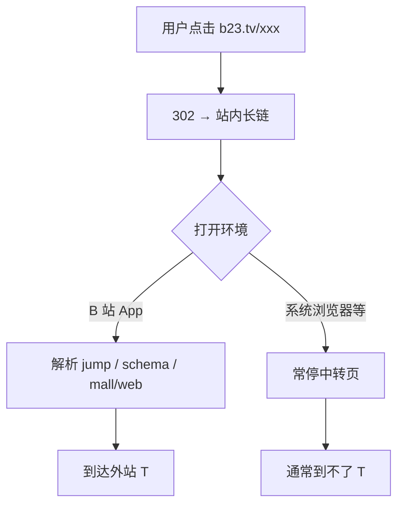
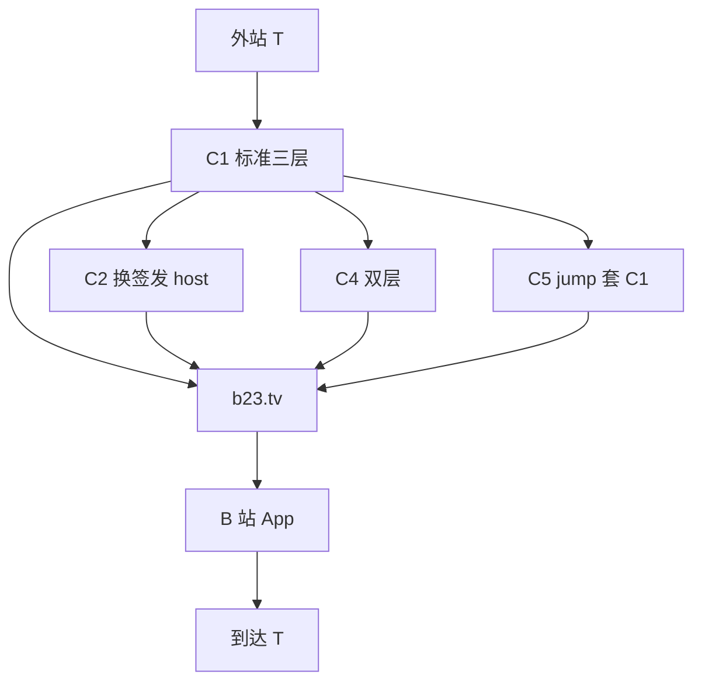
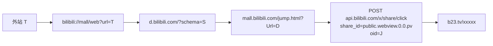
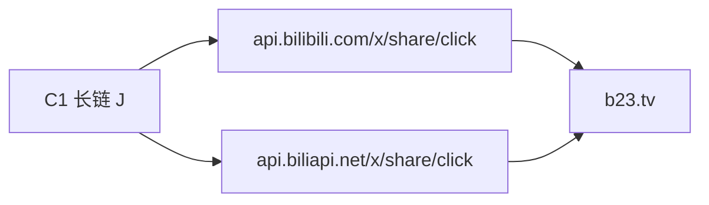
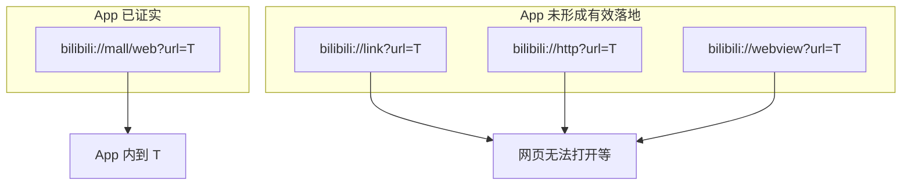
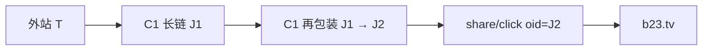
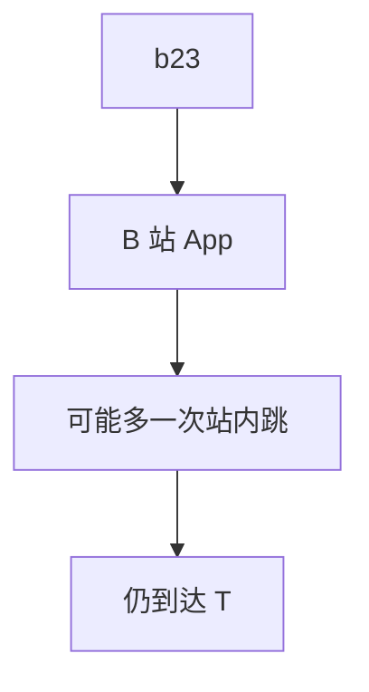
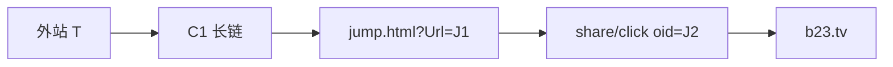

# b23wrap

[](./LICENSE)
[](https://www.python.org/downloads/)

**开源本地工具箱**：将任意 `http(s)` URL 包装为 B 站会员购 `jump.html` 长链，并调用公开分享接口签发官方 **`b23.tv`** 短链。

> ⚠️ **请先阅读 [DISCLAIMER.md](./DISCLAIMER.md)。**  
> 本项目非 B 站官方产品；仅供学习、研究与本地实验。请遵守法律与平台规则。

### 重要：跳转只在 B 站内生效

生成的 `b23.tv` **不会在普通浏览器里直接打开你填的网址**。

| 打开方式 | 常见结果 |
|---|---|
| **B 站 App 内**点击短链 | 才可能执行 `mall/web`，打开你指定的目标站 |
| 系统浏览器 / 微信内置浏览器等 | 多半停在 `d.bilibili.com` 或官方中转/唤起页，**不会**自动跳到目标站 |
| 仅复制链接到电脑 Chrome 打开 | 同样通常**到不了**目标站 |

请把短链当作「**需在 B 站客户端内打开**」的链接，而不是通用外链短址。

---

## 功能

| 能力 | 说明 |
|---|---|
| 长链包装 | 目标 URL → `mall.bilibili.com/jump.html?Url=...` |
| 官方短链 | `POST /x/share/click` → `https://b23.tv/xxxxx` |
| Web UI | 浏览器本地操作 |
| CLI | 命令行一键生成 |
| HTTP API | `POST /api/generate` 便于脚本集成 |

**零第三方 Python 依赖**（仅标准库）。

---

## 仓库
## 在线演示 (GitHub Pages)

https://ling71671.github.io/b23wrap/

> 纯静态部署。完整签发 b23 建议本机运行 python app/server.py（Pages 上浏览器可能跨域拦截 B 站接口，仍可生成包装长链）。


https://github.com/LING71671/b23wrap

```bash
git clone https://github.com/LING71671/b23wrap.git
cd b23wrap
```

## 快速开始

### 环境

- Python **3.10+**
- 可访问 `https://api.bilibili.com`

### Web 工具箱（签发 b23 请用本机服务）

> **GitHub Pages 纯静态页无法签发 b23**：浏览器跨域请求 B 站接口时，响应**没有** `Access-Control-Allow-Origin`，JS 读不到 JSON（且带 `github.io` Referer 时还可能被 WAF 403）。  
> **差的就是「同源代理」**：`python app/server.py` 在本机代请求 B 站，前端只访问 `/api/generate`。

```bash
# Windows 推荐双击
start.bat

# 或
python app/server.py
```

浏览器打开：**<http://127.0.0.1:8765/>**（不要用 file:// 打开 html）

在线演示 Pages 仍可生成**包装长链**、切换 C1–C5；完整签发请本机运行。

### 命令行

```bash
python scripts/cli.py https://www.example.com
python scripts/cli.py https://www.example.com --long-only   # 仅输出包装长链
python scripts/cli.py https://www.example.com --json
python scripts/cli.py https://www.example.com --chain c2      # 备用签发域名
python scripts/cli.py https://www.example.com --chain nest2  # 双层嵌套 C4
```

### API

```bash
# 健康检查
curl http://127.0.0.1:8765/api/health

# 生成（示例用 Python，避免 shell 转义问题）
python -c "import urllib.request,json; print(urllib.request.urlopen(urllib.request.Request('http://127.0.0.1:8765/api/generate', data=json.dumps({'url':'https://www.example.com'}).encode(), headers={'Content-Type':'application/json'})).read().decode())"
```

| 方法 | 路径 | 请求体 | 说明 |
|---|---|---|---|
| GET | `/api/health` | — | 服务状态 |
| POST | `/api/generate` | `{"url":"https://..."}` 可选 `chain` / `api_host` | 返回 `short_url` / `long_url` / `chain` 等 |

---

## 仓库结构

```text
b23wrap/
├── app/
│   ├── core.py           # 核心逻辑（L0）
│   ├── server.py         # 本地 HTTP 服务
│   └── static/           # Web UI
├── scripts/
│   └── cli.py            # 命令行入口
├── docs/
│   ├── chains.md         # 链路备份（主文在 README）
│   ├── mechanism.md      # 机制摘要
│   └── abuse-model.md    # 安全实验威胁模型
├── needtest.md           # 实验清单
├── report/               # 实验记录与 SUMMARY
├── LICENSE               # GPL-3.0
├── DISCLAIMER.md         # 免责声明（必读）
├── CONTRIBUTING.md
├── SECURITY.md
├── CHANGELOG.md
├── start.bat
└── README.md
```

---

## 已验证成功链路（App 终判）

以下链路均已在 **B 站 App** 内验证：打开生成的 `b23.tv` **可到达外站目标 T**（实验用过 `https://www.baidu.com`）。  
浏览器打不开 **不算** 成功/失败依据。

| ID | 说明 | CLI | App |
|----|------|-----|-----|
| **C1** | 标准三层：`mall/web` → `d.` → `jump` → 签发 | 默认 | ✅ |
| **C2** | 同 C1，签发 host 换 `api.biliapi.net` | `--chain c2` | ✅ |
| **C3** | 与 C1 同构（必杀 scheme = `mall/web`） | 同 C1 | ✅ |
| **C4** | 双层嵌套 C1(C1(T)) | `--chain nest2` | ✅（可多一次站内跳） |
| **C5** | 外层再 `jump?Url=` 包一层 C1 长链 | `--chain nest-jump` | ✅ |

### 打开行为（C1–C5 共通）



### 家族关系



---

### C1 — 标准三层包装（默认）



```text
T
  → bilibili://mall/web?url=<T>
  → https://d.bilibili.com/?schema=...
  → https://mall.bilibili.com/jump.html?Url=...
  → POST /x/share/click → https://b23.tv/...
```

```bash
python scripts/cli.py https://www.example.com
```

---

### C2 — 备用签发域名

包装与 **C1 完全相同**，仅签发改为 `https://api.biliapi.net/x/share/click`。



```bash
python scripts/cli.py https://www.example.com --chain c2
# 或
python scripts/cli.py https://www.example.com --api-host biliapi
```

---

### C3 — 必杀 scheme：`mall/web`

实现与 **C1 相同**。App 实测对比：只有 `bilibili://mall/web?url=T` 能稳定到外站；`link` / `http` / `webview` 等会失败。



---

### C4 — 双层嵌套

把 **整条 C1 长链** 再当作目标，再做一次 C1 包装后签发。App 可到 T，过程中**可能多跳一次 bilibili 站内页**。





```bash
python scripts/cli.py https://www.example.com --chain nest2
```

---

### C5 — jump 套 jump

内层完整 C1，外层再包：`jump.html?Url=<C1长链>`，再签发。



```bash
python scripts/cli.py https://www.example.com --chain nest-jump
```

---

### 已证伪（不要用）

| 形态 | 签发 | App |
|------|------|-----|
| `jump.html?Url=T` 裸外站（无 mall/web） | 可 | ❌ 空白页 |
| `d.bilibili.com?schema=https://T` | 可 | ❌ 无跳转 |
| `bilibili://link` / `http` / `webview` | 部分可 | ❌ / 不稳定 |
| 外站直接当 `public.webview` 的 oid | 否 | — |

### 使用限制（技术）

| 点 | 说明 |
|---|---|
| 短链真实性 | 由 B 站服务签发，非本工具伪造域名 |
| **跳转场景** | **仅在 B 站 App 内**打开短链才可能到目标站 |
| 普通浏览器 | 通常到不了目标站 |
| 客户端策略 | 版本/风控可能影响 |

API：`POST /api/generate` 可带 `"chain":"c1"|"c2"|"c4"|"c5"`、`"api_host":"biliapi"`。  

实验记录（可选）：[report/SUMMARY.md](./report/SUMMARY.md) · [docs/mechanism.md](./docs/mechanism.md)

---

## 免责声明

**完整条款见 [DISCLAIMER.md](./DISCLAIMER.md)。** 摘要：

- 非官方、无担保、使用者自担责任；
- 禁止用于欺诈、违法或误导性用途；
- 使用本软件即视为接受免责声明。

---

## 贡献

见 [CONTRIBUTING.md](./CONTRIBUTING.md)。欢迎 Issue / PR（文档、兼容性、错误处理等）。

## 安全

见 [SECURITY.md](./SECURITY.md)。请勿在 Issue 中公开可被滥用的实时攻击细节。

## License

[GPL-3.0](./LICENSE) © b23wrap contributors  

第三方商标（哔哩哔哩 / bilibili / b23.tv 等）归其权利人所有。
