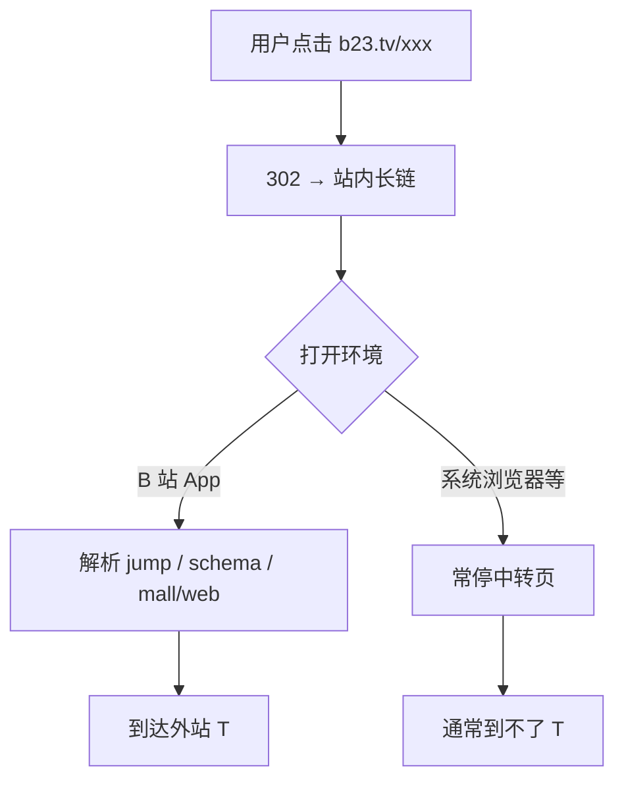
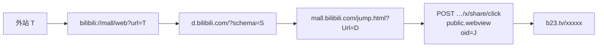
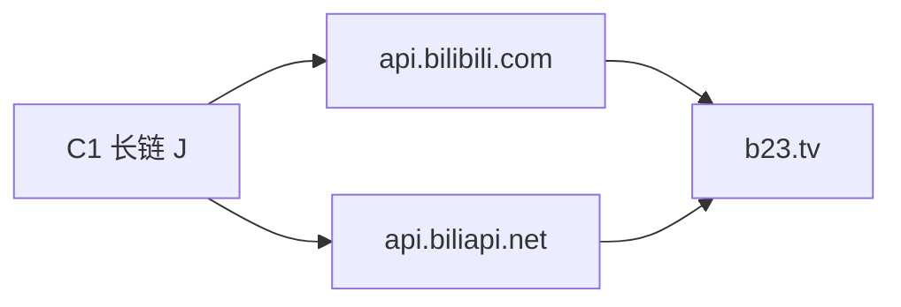
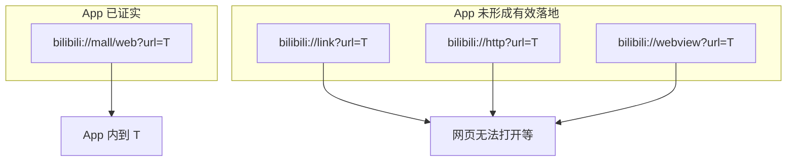
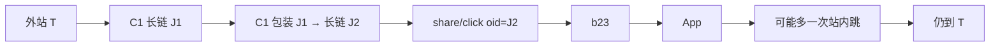
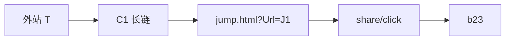
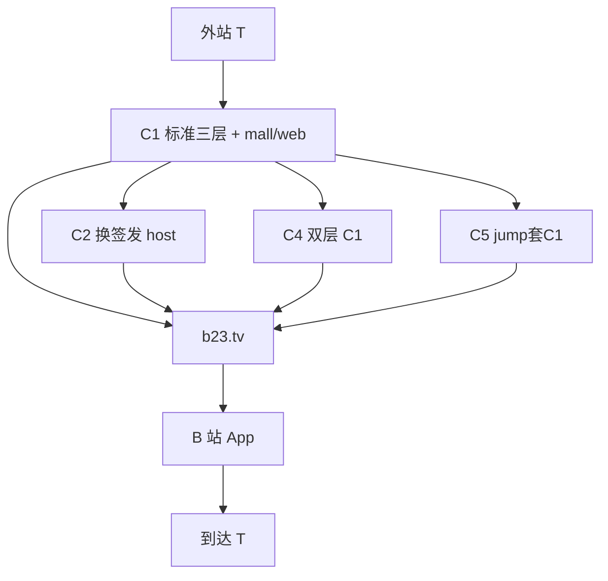

# 已验证成功链路（App 终判）

> **主文档在仓库根 [README.md](../README.md#已验证成功链路app-终判)**（含全部流程图）。  
> 本文件为同内容备份/深链入口。

**终判**：B 站 App 内打开 `b23.tv` 可到外站 T。合规见 [DISCLAIMER.md](../DISCLAIMER.md)。

---

## 总览

| ID | 名称 | 包装层 | 签发 host | App | 产品入口 |
|----|------|--------|-----------|-----|----------|
| **C1** | 标准三层包装 | mall/web → d. → jump | `api.bilibili.com` | ✅ | 默认 `generate` / CLI / UI |
| **C2** | 备用签发域名 | 同 C1 | `api.biliapi.net` | ✅ | `--api-host biliapi` |
| **C3** | 显式 mall/web（同构 C1） | 同 C1 | 默认 | ✅ | 与 C1 相同实现 |
| **C4** | 双层嵌套 | C1(C1(T)) | 默认 | ✅（可多一次站内跳） | `--chain nest2` |
| **C5** | jump 套 jump | jump(Url=C1长链) | 默认 | ✅ | `--chain nest-jump` |

公共打开行为：



---

## C1 — 标准三层包装（默认产品）

**App 样例**：`r7i1YAD`、`SK2iK31` 等 → 成功到 T。



**结构（逻辑）**

```text
T
  → bilibili://mall/web?url=<urlencode T>
  → https://d.bilibili.com/?schema=<…>
  → https://mall.bilibili.com/jump.html?Url=<…>
  → POST share/click → https://b23.tv/…
```

**代码**：`build_jump_long_url` + `mint_b23` · `generate()`

```bash
python scripts/cli.py https://www.example.com
```

---

## C2 — 备用签发域名

**包装与 C1 完全相同**，仅签发改为：

`https://api.biliapi.net/x/share/click`

**App 样例**：`kyr7SC6` → 成功。



```bash
python scripts/cli.py https://www.example.com --api-host biliapi
```

---

## C3 — 显式 mall/web

与 **C1 同一实现**（必杀组件即 `bilibili://mall/web?url=`）。  
**App 样例**：`sAzFlNW` → 成功。单独列出仅强调：**有效 deeplink 是 mall/web，不是 link/http/webview**。



---

## C4 — 双层嵌套

将 **整条 C1 长链** 再当作「目标 URL」做一次 C1 包装后签发。

**App 样例**：`J1QbDa5` → 成功；过程中**可能多跳一次 bilibili 站内页**。



```bash
python scripts/cli.py https://www.example.com --chain nest2
```

---

## C5 — jump 套 jump

外层：`jump.html?Url=<C1 长链>`（内层已是完整 C1），再 `public.webview`。

**App 样例**：`1C9lzGI` → 成功。



```bash
python scripts/cli.py https://www.example.com --chain nest-jump
```

---

## 家族关系图



---

## 已证伪 / 半吊子（不要当产品能力）

| 形态 | 签发 | App | 说明 |
|------|------|-----|------|
| `jump.html?Url=T` 裸外站 | 可 | ❌ 空白页 | 能污染短链，不落地 |
| `d.bilibili.com?schema=https://T` | 可 | ❌ 无跳转 | |
| `bilibili://link` / `http` / `webview` | 部分可 | ❌/🟨 | 无法打开或不可用 |
| 外站直接作 `public.webview` oid | 否 | — | 必须先站内包装 |

---

## 相关文档

| 文件 | 内容 |
|------|------|
| [mechanism.md](./mechanism.md) | C1 机制摘要 |
| [abuse-model.md](./abuse-model.md) | 安全实验威胁模型 |
| [../report/SUMMARY.md](../report/SUMMARY.md) | 实验记录与样例 short |
| [../needtest.md](../needtest.md) | 实验清单 |
