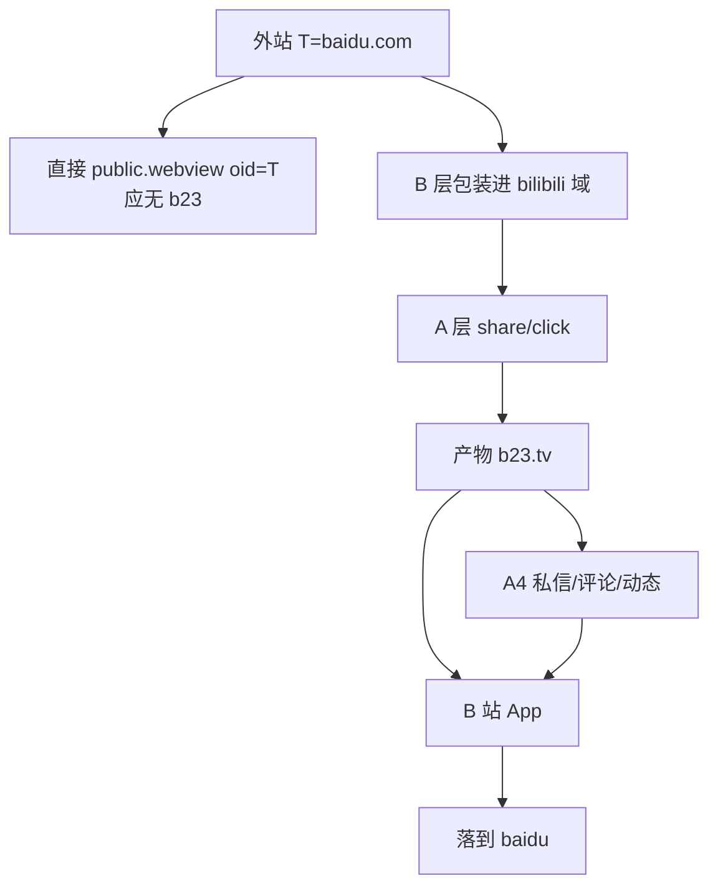
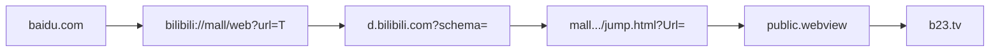

# 滥用场景实验清单（needtest）

> **目标**：模拟「可信域 / 官方短链洗白外站」及**同类**危害，供平台侧排查。  
> **Sink**：`https://www.baidu.com`（代替真实违规站）。  
> **终判**：你在 **B 站 App** 内是否落到 baidu（或明确钓鱼结果）；浏览器打不开 **≠** 失败。  
> **威胁模型全文**：[docs/abuse-model.md](./docs/abuse-model.md)  
> **合规**：[DISCLAIMER.md](./DISCLAIMER.md)

本文件**不是**「B 站功能好不好用」的验收表。无外站/钓鱼危害的路径已删除，不进主表。

---

## 状态图例

| 标记 | 含义 |
|------|------|
| ✅ | **App 内**确认达到滥用向期望（到 baidu / 钓鱼成立），或产品已交付的主路径 |
| 🟨 | 已有**可测产物**，App 终判未记 |
| ⬜ | 未测 / 无产物 |
| ❌ | **你在 App 内确认**该滥用路径不成立 |
| 🚫 | 需登录 UGC 等单独环境 |
| 📦 | 积木 / 归档，不单独判「洗白成功」 |

---

## 主表 · 威胁类 A（优先）

| ID | 危害 | 期望（App 终判） | 状态 | 报告 |
|----|------|------------------|------|------|
| **A1** | mall `jump.html` + `mall/web` + `public.webview`，**T=baidu** → 官方 b23 | 打开 b23 **到达百度** | **✅ App 成功** | [report/A1](./report/A1/) · [SUMMARY](./report/SUMMARY.md) |
| **A1-alt-host** | 同 A1 载荷，签发改 `api.biliapi.net` | 同上 | **✅ App 成功** | [report/A1-alt-host](./report/A1-alt-host/) |
| **A1-title** | A1 + 诱导 `share_title`（标题≠落地） | 文案诱导 + 仍到百度 | 🟨 签发可·title未进content | [report/A1-title](./report/A1-title/) |
| **A2-container** | 简化 `jump?Url=外站` / d.schema=外站 | 到百度 | **❌ App 未落地**（能签发） | [report/A2-container](./report/A2-container/) |
| **A2-deeplink** | 仅 **mall/web** 有效；link/http/webview 否 | 到百度 | **✅ mall/web · 其它❌/🟨** | [report/A2-deeplink](./report/A2-deeplink/) |
| **A3-passport** | 登录/退出/注册 `gourl` → 外站 | 外跳 | 🟨 未登录未证实 | [report/A3-passport](./report/A3-passport/) |

### 传播放大器 A4（依赖 A1/A2 已有脏产物）

| ID | 危害 | 期望 | 状态 | 报告 |
|----|------|------|------|------|
| **A4-dm** | 私信卡片挂脏 b23 / title 脱节 | 接收方点开后 A1 结果 | 🚫 | [report/A4-dm](./report/A4-dm/) |
| **A4-reply** | 评论贴脏 b23 | 同上 | 🚫 | [report/A4-reply](./report/A4-reply/) |
| **A4-dynamic-web** | 动态 WEB `jump_url`=baidu 或脏 b23 | 外跳或二次打开脏链 | 🚫 | [report/A4-dynamic-web](./report/A4-dynamic-web/) |
| **A4-dynamic-goods** | GOODS 节点外链可控性 | 外站商品/任意外链 | 🚫 | [report/A4-dynamic-goods](./report/A4-dynamic-goods/) |

---

## 积木 · 类 B（不单独算洗白成功）

| ID | 作用 | 状态 | 报告 |
|----|------|------|------|
| **B-mint-policy** | 签发策略：站内可签发；**baidu 直接 oid 失败** | 🟨 符合预期 | [report/B-mint-policy](./report/B-mint-policy/) |
| **B-nest** | 多层嵌套仍指向 **baidu** | **✅ App 成功**（可多一次站内跳） | [report/B-nest](./report/B-nest/) |


## 组合矩阵

```text
T = https://www.baidu.com

载荷 B:  A1(jump+mall/web) | A2 其它容器 | 直接 oid(应失败=B-mint-policy)
签发 A:  api.bilibili.com | api.biliapi.net | + share_title
传播 P:  复制 | 私信 | 评论 | 动态
打开 O:  B 站 App（终判）
```

**建议顺序**

1. A1（T=baidu）  
2. B-mint-policy 负例（oid=baidu 直接）  
3. A1-alt-host  
4. A1-title  
5. A2-container / A2-deeplink  
6. B-nest（包 baidu）  
7. A3-passport  
8. A4-*（挂已成功脏 b23）



---

## A1 流程（主滥用原型）



产物与 App 表：[report/A1/products.md](./report/A1/products.md)

---

## 附录 · 已删除的旧项（勿再当「可能到 baidu」）

已从仓库移除：`report/L0`–`L18`、业务-only 短链验收、开屏 splash、失效 share_id 专档、站内 b23 大礼包等。

| 曾用旧号 | 若仍相关则对应 |
|----------|----------------|
| L0 | A1 |
| L1 | B-mint-policy |
| L2 | A1-alt-host |
| L5 | A1-title |
| L6–L8 | A3-passport |
| L9 / L12 | A4-dm / A4-reply |
| L10 / L11 | A4-dynamic-* |
| L13 / L14 | A2-container |
| L16 | A2-deeplink |
| L17 | B-nest |
| L3 / L4 / L15 / L18 | **已删，不测** |